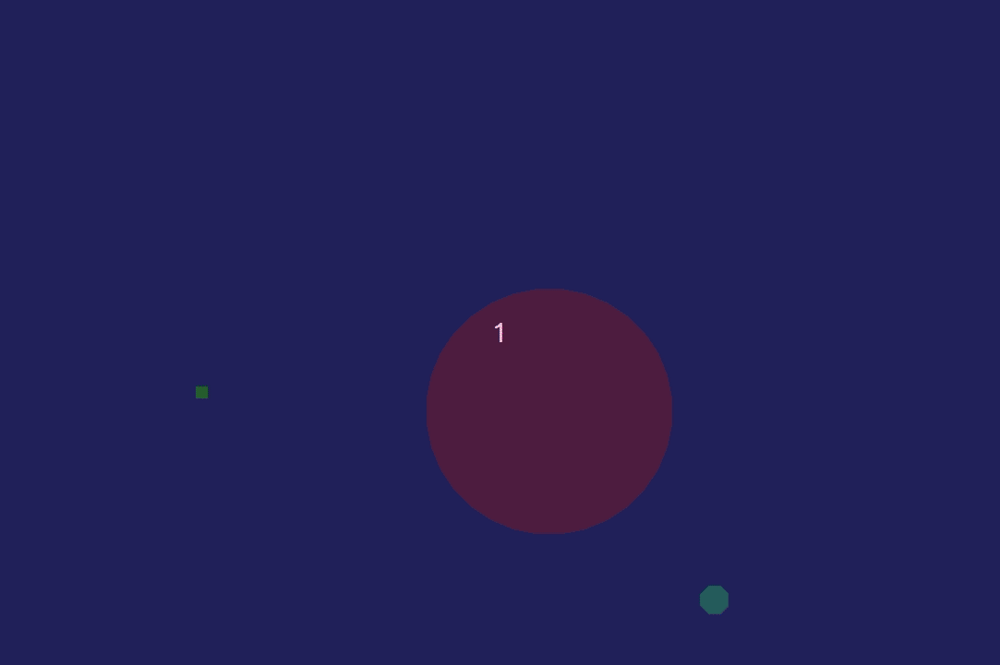

# gravity-assist
## See the description below!
  
  
## How to run? 
After cloning the repo, on unixlike platform run:

  $ cabal install gloss && cabal run
  
Aforementioned command should install the only required dependency and start simulation in full screen.

## How to move around? 
You can move around in the simulation by dragging the screen with your mouse and zoom in/out with your mouse's wheel,
that's kind of important, because the final effect is not observable without doing some wild mouse involved manoeuvres ;)

## Assumptions and description
  This simulation deliberately does not coalesce with any physical units, instead, it facilliates the user to operate on the ratios of objects' properties. Thanks to that, user himself can choose parameters that would suit himself and simulate the system of his own.
  
  The planet is moving with a constant velocity vector downwards, because it is assumed that somewhere, in the galaxy far, far away, some big celestial body exist, with a mass such great, that all bodies in the system are treated as if they were a homogenious body. Therefore, local attractive force may be simulated with unidirectional movement of the planet.
  The moon is orbiting the planet with an orbital speed derived by me according to the [formula](https://en.wikipedia.org/wiki/Orbital_speed).
  
  The space shuttle (color green) is entering the planet's orbit and uses moon's gravity assist to defeat the planet's attractive force, gaining the speed greater than orbital, thus allowind to escape the orbit with greater speed than at the beggining.
  
  Unfortunately, I wasn't able to print the information about velocities and positions on the screen (Gloss, as far I checked does not have this in its library), the option here was to print everything to stdout in console, but I decided to remove all debug logs that I was using and leave it as it is now.
  
  You can find more information in the comments section in source.
 
